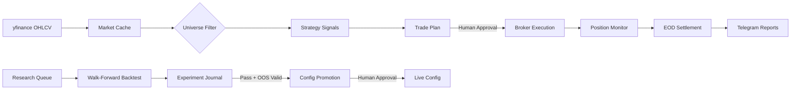

<div align="center">

# ⚡ Atlas

**Algorithmic swing-trading lab that researches, backtests, and live-trades systematic strategies across global equity markets.**

[](https://python.org)
[](#-markets)
[](#-strategies)
[](#-automation)

---

**S&P 500** via Moomoo &nbsp;•&nbsp; **ASX 200** via Interactive Brokers &nbsp;•&nbsp; **Hang Seng** via Interactive Brokers

</div>

---

## 🏗️ Architecture

```
┌─────────────────────────────────────────────────────────────────────┐
│                        ATLAS TRADING SYSTEM                        │
├─────────────────────────────────────────────────────────────────────┤
│                                                                     │
│   ┌──────────┐    ┌──────────┐    ┌──────────┐    ┌──────────┐     │
│   │  Ingest   │───▶│ Universe │───▶│ Strategy │───▶│  Planner │     │
│   │ (yfinance)│    │  Filter  │    │  Engine  │    │          │     │
│   └──────────┘    └──────────┘    └──────────┘    └────┬─────┘     │
│                                                         │           │
│                                                         ▼           │
│   ┌──────────┐    ┌──────────┐    ┌──────────┐    ┌──────────┐     │
│   │Dashboard │◀───│ Journal  │◀───│ Executor │◀───│ Approval │     │
│   │(Telegram)│    │ & Ledger │    │ (Broker) │    │  Gate 🔒 │     │
│   └──────────┘    └──────────┘    └──────────┘    └──────────┘     │
│                                                                     │
│   ┌─────────────────────────────────────────────────────────────┐   │
│   │              🔬 RESEARCH PIPELINE                           │   │
│   │  Hypothesis → Backtest → Analyse → Promote → Live          │   │
│   │  (queue.json)  (8-core)  (journal)  (candidate)  (config)  │   │
│   └─────────────────────────────────────────────────────────────┘   │
│                                                                     │
└─────────────────────────────────────────────────────────────────────┘
```

### Data Flow



---

## 🌍 Markets

| Market | Tickers | Broker | Currency | Status |
|--------|---------|--------|----------|--------|
| 🇺🇸 **S&P 500** | 292 | Moomoo | USD | ✅ Live |
| 🇦🇺 **ASX 200** | 248 | Interactive Brokers | AUD | ✅ Live |
| 🇭🇰 **Hang Seng** | 130 | Interactive Brokers | HKD | 🔧 Setup |

Adding a new market requires only a `MarketProfile` class — strategies, backtest engine, and CLI work automatically.

---

## 📈 Strategies

### Active (Live Trading)

| Strategy | Style | Holding | Markets |
|----------|-------|---------|---------|
| **Mean Reversion** | RSI(14) oversold + z-score entry, ATR profit target | 3–10 days | SP500 |
| **Trend Following** | Breakouts above dual MA crossover with volume confirmation | 5–20 days | SP500, ASX |
| **Opening Gap** | Fade significant overnight gaps with IBS confirmation | 1–3 days | SP500 |

### Research Pipeline (Disabled, Under Optimisation)

| Strategy | Hypothesis | Status |
|----------|-----------|--------|
| **Connors RSI(2)** | Ultra-short RSI(2) < 10 entries, SMA(5) exit — 74%+ historical win rate | 🧪 Wave 2 |
| **BB Squeeze** | Bollinger Band squeeze breakouts with Keltner Channel confirmation | 📊 Needs optimisation |
| **Momentum Breakout** | 52-week high breakouts with relative strength ranking | 📊 Needs optimisation |
| **MTF Momentum** | Multi-timeframe momentum alignment (weekly + daily) | 🔧 Confidence scoring fix |
| **Sector Rotation** | Rotate into strongest sectors based on relative strength | 📊 Needs optimisation |
| **Short-Term MR** | Aggressive mean reversion with tighter stops | 📊 Needs optimisation |
| **Dividend Capture** | Enter before ex-dividend, capture yield + price recovery | 📊 Needs optimisation |

---

## 🔬 Research System

Atlas runs a continuous research pipeline that autonomously discovers, tests, and promotes strategy improvements.

```
 🎩 Researcher        🧪 Backtester         📊 Analyst          🛡️ Risk
 ─────────────        ─────────────         ──────────          ─────────
 Read journal    ───▶  Execute queue   ───▶  Evaluate     ───▶  OOS validate
 Scan for gaps         (8-core ∥)           Annotate            Stage candidate
 Queue hypotheses      Walk-forward          Journal             Telegram → Approve
```

**Key features:**
- **Walk-forward backtesting** — 252-day train / 63-day test / 21-day step windows, no look-ahead bias
- **Parallel execution** — 8-core parallelism, experiments batched for maximum throughput
- **Queue validation** — `append_to_queue()` validates experiment configs against runner contracts at insertion time, preventing aspirational experiments from wasting compute
- **Promotion gates** — OOS validation → regression check → rate limit (max 1/week/market) → human approval via Telegram
- **Experiment journal** — every result (pass or fail) is logged with learnings for future reference

---

## 🛡️ Risk Management

```
Per-Trade:     0.5% max risk (SP500) / 2% max risk (ASX)
Positions:     Max 15 (SP500) / Max 7 (ASX)
Sector:        Max 2 positions per sector
Daily DD:      2% max → auto-halt trading
Stop-Loss:     Required on every position (broker-side GTC orders)
Confidence:    Min 0.75 (SP500) / 0.80 (ASX) signal threshold
```

**Broker-side protective orders** — stop-loss orders are placed directly on the exchange as GTC stops, not just tracked internally. Prices are rounded to valid tick sizes per exchange (ASX 3-tier, SEHK 11-tier, US $0.01).

---

## ⚙️ CLI

```bash
# ── Portfolio ──────────────────────────────────────────
atlas status                        # positions, P&L, equity
atlas status -m sp500               # target specific market

# ── Daily Workflow ─────────────────────────────────────
atlas ingest                        # refresh OHLCV data
atlas universe                      # rebuild filtered universe
atlas plan                          # generate today's trade plan
atlas approve                       # approve pending plan
atlas live-run                      # execute via live broker

# ── Analysis ───────────────────────────────────────────
atlas backtest                      # walk-forward backtest
atlas ledger                        # trade history
atlas review                        # performance vs expectations

# ── Broker ─────────────────────────────────────────────
atlas broker                        # connection status
atlas orders                        # open orders
atlas sync                          # reconcile with broker
atlas halt                          # emergency: cancel everything

# ── Markets ────────────────────────────────────────────
atlas markets                       # list available markets
```

> All commands accept `--market` / `-m` to target a specific market.

---

## 🤖 Automation

Daily operations run via [Pi](https://github.com/mariozechner/pi-coding-agent) cron agents (AEST, Mon–Fri):

| Time | Market | Job | Description |
|------|--------|-----|-------------|
| `07:00` | 🇦🇺 ASX | Pre-market | Data refresh → plan → Telegram summary |
| `08:45` | 🇦🇺 ASX | Protective orders | Sync stop-loss orders to IBKR |
| `10:15` | 🇭🇰 HK | Protective orders | Sync stop-loss orders to IBKR |
| `16:30` | 🇦🇺 ASX | Post-close | EOD settlement → dashboard → report |
| `18:30` | 🇺🇸 SP500 | Pre-market | Data refresh → plan → Telegram summary |
| `19:15` | 🇺🇸 SP500 | Protective orders | Sync stop-loss orders to Moomoo |
| `08:00+1` | 🇺🇸 SP500 | Post-close | EOD settlement → dashboard → report |
| `09:00` | All | Research | Autonomous experiment execution |

**Telegram integration** — alerts on plan summaries (📊), equity snapshots (📈), errors (🚨), and promotion requests with inline Approve/Reject buttons.

---

## 📁 Project Structure

```
atlas/
├── backtest/           Walk-forward engine with metrics & equity curves
├── brokers/            Broker adapters (Moomoo, IBKR) + protective orders
│   ├── ibkr/           Interactive Brokers adapter + tick-size rounding
│   └── state/          Live portfolio state per market
├── config/
│   ├── active/         Live configs (sp500.json, asx.json, hk.json)
│   ├── candidates/     Staged configs awaiting promotion
│   └── versions/       Versioned config history
├── dashboard/          HTML dashboard + live price feeds
├── data/               yfinance ingestion + per-market parquet cache
├── markets/            Market profiles (SP500, ASX, HK)
├── monitor/            Position monitoring + alert evaluation
├── research/
│   ├── experiments/    Experiment result envelopes (exp-*.json)
│   ├── waves/          Wave briefs and batch results
│   ├── queue.json      Experiment queue with validation
│   └── journal.json    All findings, pass or fail
├── scripts/            CLI, cron, settlement, health checks, research runner
├── strategies/         Strategy implementations (BaseStrategy ABC)
├── universe/           Liquidity & quality filtering
├── utils/              Indicators, Telegram, config, logging
└── pi-package/         Pi agent skills for autonomous operations
```

---

## 🔧 Setup

### Requirements

- Python 3.10+
- **Core:** `pandas`, `numpy`, `yfinance`
- **Live trading:** `moomoo-api`, `ib_insync`
- **Automation:** [Pi](https://github.com/mariozechner/pi-coding-agent)

### Credentials

```bash
python3 scripts/cli.py setup-secrets    # interactive setup
```

Stored in `~/.atlas-secrets.json` (never committed):

```json
{
  "telegram_bot_token": "...",
  "telegram_chat_id": "...",
  "moomoo_trade_pwd": "...",
  "ibkr_host": "127.0.0.1",
  "ibkr_port": 4001
}
```

### Adding a New Market

```python
# markets/new_market.py
class NewMarket(MarketProfile):
    market_id = "new_market"
    display_name = "New Market"
    currency = "XXX"
    benchmark_ticker = "INDEX"
    # ... define tickers, fees, hours
```

Then add `config/active/new_market.json` — everything else works automatically.

---

<div align="center">

*Built for live trading. Broker is sole source of truth — no paper trading layer.*

</div>
